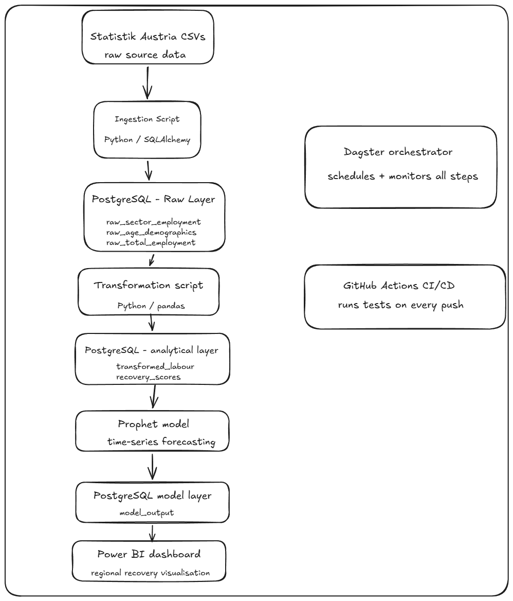

# Austrian Labor Market Resilience Analysis

## Research Question
Do Austrian regions with older average populations recover more slowly from 
labor market shocks — and does sector composition (healthcare-heavy vs 
manufacturing-heavy) change that recovery pattern?

## Key Findings

**Finding 1: Demographic aging correlates with slower recovery.**  
Regions with higher old age dependency ratios in 2019 showed systematically 
weaker employment recovery by 2023. The relationship is consistent across 
most Austrian Bundesländer.

**Finding 2: Vienna is a structural outlier.**  
Vienna combines the youngest demographic profile, lowest manufacturing 
exposure, and strongest post-COVID recovery (7.74%) of all nine regions. 
Excluding Vienna, the average recovery gap between service-oriented and 
manufacturing-heavy regions collapses from 1.38 to -0.03 percentage points — 
effectively zero.

**Finding 3: Sector composition alone does not predict recovery.**  
Once Vienna is excluded, manufacturing-heavy regions (Vorarlberg, Upper 
Austria, Styria: avg 3.54%) and service-oriented regions (Salzburg, 
Burgenland: avg 3.51%) show virtually identical recovery scores. Demographics 
remain the more consistent explanatory variable across the remaining 
eight regions.

**Finding 4: Carinthia took the hardest COVID shock.**  
At -3.47% employment drop in 2020, Carinthia was the most exposed region — 
consistent with its above-average manufacturing share and older demographic 
profile.

## Pipeline Architecture



Statistik Austria CSVs
↓
Ingestion (Python/SQLAlchemy) → PostgreSQL raw layer
↓
Transformation (Python/pandas) → PostgreSQL analytical layer
↓
Forecasting (Prophet) → PostgreSQL model layer
↓
Dashboard (Power BI)
Orchestration: Dagster (monthly schedule)
CI/CD: GitHub Actions (runs on every push to main)

## Tech Stack

| Layer | Technology |
|---|---|
| Orchestration | Dagster |
| Storage | PostgreSQL (Docker) |
| Ingestion | Python, SQLAlchemy |
| Transformation | Python, pandas |
| Modeling | Prophet |
| Visualization | Power BI |
| Testing | pytest (19 tests) |
| CI/CD | GitHub Actions |
| Environment | uv, Docker Compose |

## Project Structure

austria-labor-resilience/
├── ingestion/              # Extract + Load scripts
│   ├── ingest_labour.py    # Full dataset ingestion
│   └── ingest_labour_ci.py # Sample data for CI
├── transformation/         # Transform scripts
│   └── transform_labour.py # Cleaning, joining, feature engineering
├── models/                 # Forecasting
│   └── forecast_employment.py # Prophet model, 2026-2028
├── analysis/               # EDA notebooks
│   └── eda.ipynb           # Full exploratory analysis
├── dagster_pipeline/       # Orchestration
│   ├── assets.py           # Pipeline asset definitions
│   └── definitions.py      # Jobs and schedules
├── tests/                  # Test suite
│   ├── test_transformations.py  # Unit tests (7)
│   └── test_data_quality.py     # Data quality tests (12)
├── dashboard/              # Power BI file
├── data/
│   ├── raw/                # Source CSVs (gitignored)
│   └── samples/            # Sample data for CI (committed)
├── docs/                   # Architecture diagram and charts
├── docker-compose.yml      # Local PostgreSQL instance
└── .github/workflows/      # CI/CD pipeline

## Data Sources

- **Statistik Austria / STATcube**: Regional labour force survey data 2013–2025
  - Sector employment by region (Manufacturing, Healthcare)
  - Total employment by region
  - Population by age group by region
- Survey methodology: Austrian Micro Census, ~1,500 households/week
- Geographic level: NUTS 2 (9 Austrian Bundesländer)

## How To Run Locally

### Prerequisites
- Docker Desktop installed and running
- Python 3.12+
- uv installed (`pip install uv`)
- Power BI Desktop (for dashboard)

### Steps

**1. Clone the repository**
```bash
git clone https://github.com/abdallahtawheed/austria-labor-resilience.git
cd austria-labor-resilience
```

**2. Configure environment**
```bash
cp .env.example .env
# Edit .env with your database credentials
```

**3. Start PostgreSQL**
```bash
docker-compose up -d
```

**4. Install dependencies**
```bash
uv sync
```

**5. Download source data**

Download the following tables from [STATcube](https://statcube.at/statistik.at/ext/statcube/jsf/dataCatalogueExplorer.xhtml) as 
CSV database format and place in `data/raw/`:
- Labour Force Survey: sector employment by region by year (Manufacturing + Healthcare)
- Labour Force Survey: total employment by region by year
- Labour Force Survey: population by age group by region by year

See `docs/statcube_download_guide.md` for exact table configurations.

**6. Run the pipeline**
```bash
# Option A: Run via Dagster UI
dagster dev
# Open http://localhost:3000 → Materialize all

# Option B: Run scripts directly
uv run python ingestion/ingest_labour.py
uv run python transformation/transform_labour.py
uv run python models/forecast_employment.py
```

**7. Run tests**
```bash
uv run pytest tests/ -v
```

**8. Open dashboard**

Open `dashboard/austria_labour_resilience.pbix` in Power BI Desktop.
Connect to your local PostgreSQL instance when prompted.

## Limitations and Further Research

**Methodology break (2021):** Statistik Austria introduced a new ILO 
questionnaire in 2021, creating a structural break in the time series. 
Pre and post-2021 figures are not directly comparable. This limits the 
precision of COVID recovery analysis and is treated as a known limitation 
throughout.

**Migration and healthcare employment:** Austria's healthcare sector 
relies heavily on foreign-born workers, particularly for the 24-hour 
home care system (Personenbetreuung). Healthcare employment in older 
regions may be sustained by migration flows rather than domestic labor 
market dynamics — a distinction this dataset cannot resolve. Regional 
migration statistics would be required for a fuller analysis.

**Sample size:** Nine regions is a small sample for statistical inference. 
Trend lines and correlations should be interpreted as descriptive rather 
than inferential. Results are suggestive, not conclusive.

**Further research directions:**
- Incorporate regional migration statistics to isolate the healthcare 
  migration effect
- Extend to municipality level (NUTS 3) for finer geographic resolution
- Add wage data to distinguish employment quantity from employment quality
- Compare Austrian patterns against other EU member states with similar 
  aging profiles (Germany, Italy, Portugal)

## CI/CD Status


## Author

Abdallah Abdelmagid — MSc Data Science & AI, FH Joanneum Graz  
[LinkedIn](https://www.linkedin.com/in/abdallah-abdelmagid-8b5549175/) | 
[GitHub](https://github.com/abdallahtawheed)